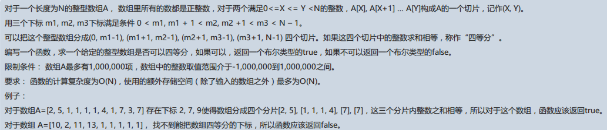

# 2017阿里巴巴Java研发编程题  
  
## 注意：题目中有一处自相矛盾的地方：
* 一开始说是正整数数组，但在后面的限制条件中又说范围有负数。  
--------------------------------------------------------  
    最近有很多小伙伴来问我这题，看着大家都做完测试题开始相互询问有没有面试了，估摸着差不多这轮测评也应该是结束了，就把我想的解题方法放出来吧。
    PS：如果还没结束，请立即通知我！我会马上删除！
### 声明：
* 鉴于之前所说的题目中的自相矛盾处，我原本是准备考虑负数，所以用了vector。哪知写到最后才发现对于首尾两块寻找时的m1、m2的移动策略就不能简单地去写了。由于已经深夜，就先写了个只支持正数的移动策略，以后有时间细想想应该能支持负数。
* 我的这个算法核心思路是先扫描一遍数组，得到所需要的额外数据，再分别从前后探查数组。故最多只要扫描两遍，所以时间复杂度为O(n)；额外存储空间也只有两个map，为O(n)，符合题目要求。
### 最后的吐槽：
    我自己悲催的内推经历：这次的阿里内推，我竟然忘记改岗位了！于是我这么一个c++“大神”就只好去面了Java岗。最惨的是，我在回答mvc的时候说了一句“我对web不熟”，结果对方说他们就是做web的。好吧，到现在也没消息应该是被刷了。